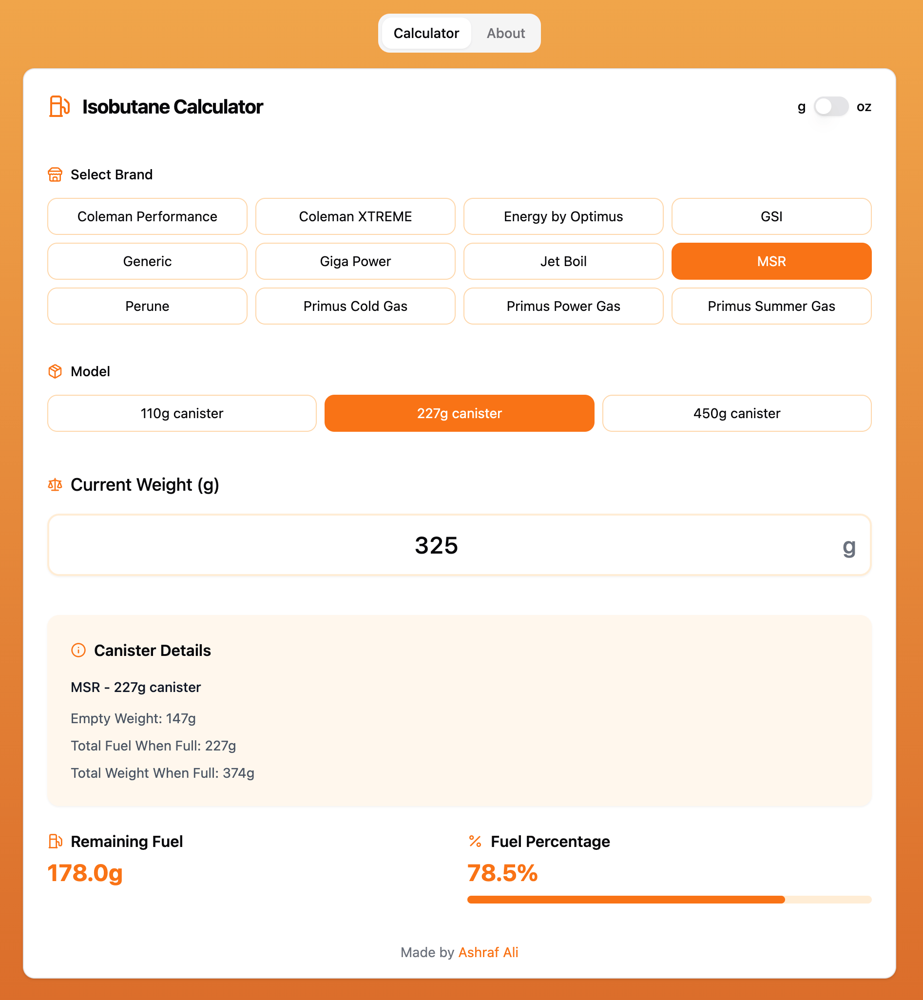

# Isobutane Canister Calculator

A web-based calculator to help determine the remaining fuel in isobutane canisters commonly used for camping and backpacking stoves.



## Live Demo & Source

- **Live Demo:** [Isobutane Calculator](https://ashrafali.net/labs/isobutanecalc)
- **Source Code:** [GitHub Project](https://github.com/nerveband/isobutane-canister-calculator)

## Features

- Calculate remaining fuel percentage based on current weight
- Support for multiple brands and models:
  - MSR
  - Jetboil
  - Giga Power
  - GSI
  - Optimus
  - Coleman Performance
  - Coleman XTREME
  - Primus (Power Gas, Summer Gas, Cold Gas)
  - Perune
- Multiple canister sizes (110g, 230g, 450g)
- Toggle between grams and ounces
- Real-time weight validation
- Visual fuel level indicator
- Detailed canister information
- Mobile-friendly interface
- Progressive Web App (PWA) support
- Works offline
- No installation required

## Development

### Tech Stack

- Next.js 14
- React 19
- TypeScript
- Tailwind CSS
- shadcn/ui components
- PWA support with next-pwa

### Prerequisites

- Node.js 18.17 or later
- npm or yarn

### Getting Started

1. Clone the repository:
```bash
git clone https://github.com/nerveband/isobutane-canister-calculator.git
cd isobutane-canister-calculator
```

2. Install dependencies:
```bash
npm install
```

3. Run the development server:
```bash
npm run dev
```

4. Open [http://localhost:3000](http://localhost:3000) in your browser.

### Building for Production

1. Create a static build:
```bash
npm run static
```

This will:
- Build the Next.js application
- Generate static files in the `out` directory
- Copy the files to a `dist` directory ready for deployment
- Generate PWA assets and service worker

### PWA Features

The app includes full Progressive Web App support:
- Installable on mobile and desktop devices
- Works offline
- App-like experience
- Automatic updates when online
- Responsive design for all screen sizes

### Data Sources

The weight data used in this calculator is sourced from [Bantam Outdoors](https://bantamoutdoors.com/wp-content/uploads/2023/02/Isobutane-Canister-Weight-Table-g.pdf). We maintain an extensive database of canister specifications to ensure accurate calculations.

## Contributing

Contributions are welcome! Please feel free to:
- Submit bug reports or feature requests through GitHub Issues
- Create Pull Requests for improvements
- Share data for additional canister brands/models

### Adding New Canister Data

If you have data for a canister brand or model that's not listed, please include:
- Brand name
- Model name/number
- Empty canister weight
- Full canister weight
- Fuel capacity
- Source of information

## License

MIT License - see the [LICENSE](LICENSE) file for details.

## Author

Created by [Ashraf Ali](https://ashrafali.net) 